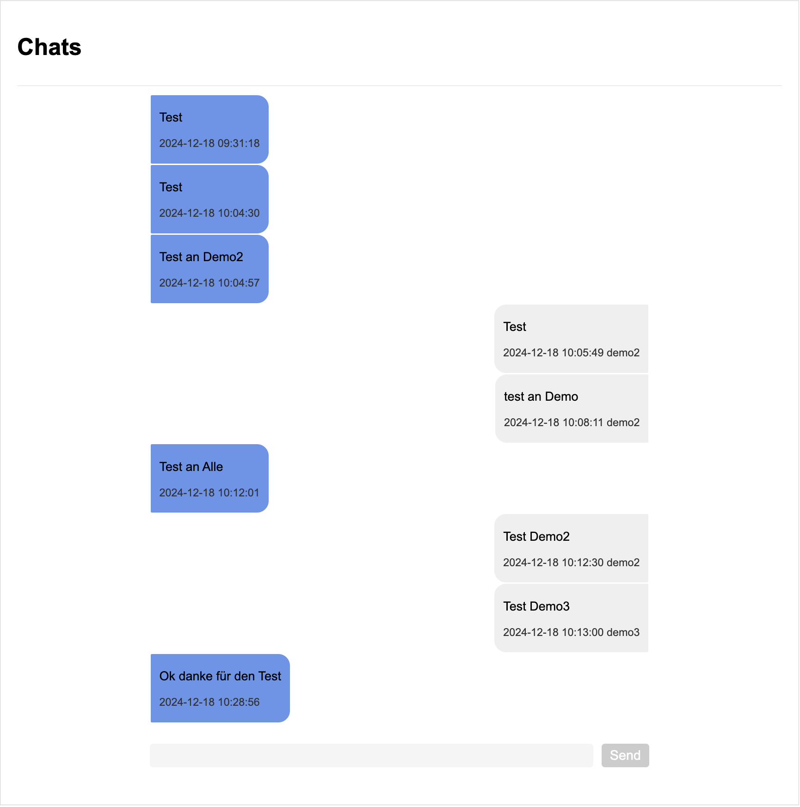

# Aufgabe 5 / 6

#### Schuljahr: 24/25
#### Lehrgang: 2
#### Übungstag: 11.12.2024
#### Name: Jakob Lipp
#### Klasse: 3a APC
#### Gruppe: B

## Installation
Öffne CMD oder Terminal

```
git clone https://github.com/LBSEibiswaldITL12/A5.git

# oder über ssh

git clone git@github.com:LBSEibiswaldITL12/A5.git


cd A5
docker compose up -d

# Open localhost:80 in web
```

## Umsetzung Aufgabe 5

Aufsetzen des Huge Frameworks mit Docker. War etwas überlegungsaufwand immer darauf achten ob man einen driver hizufügen muss bei den Docker files.

## Umsetzung Aufgabe 6

Für das Registrieren eines neuen Users muss man als Admin eingeloggt sein. Und die Capture beim Registrieren haben wir entfernt.

## Umsetzung Aufgabe 7

Ich habe Drei neue Tabellen in die Datenbank eingefügt

```
// speichert einen gesamten chat
TABLE chat

// Sind die Nachrichten eines Chats
TABLE messages

// Eine Referenztabelle in der ein User mit einem Chat verbunden wird
TABLE usrToMsgChat
```

Jetzt haben wir mehrer Chats und auch Gruppen für alle User. Im Chat sieht man dann die Nachricht von wem sie Geschrieben wurde und wann.

